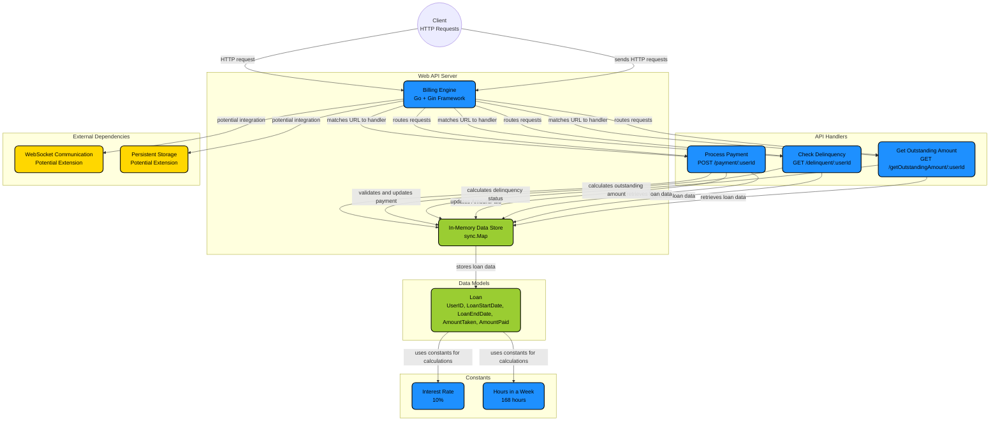

# billingEngine
A simple billing engine application written in Go using websockets.

## Overview
This application provides a basic billing system where users can track their loan payments. It exposes an HTTP API to retrieve the total amount paid by a user.

## Input
The application uses a predefined set of loans as input:

```go
loans = []Loan{
    {UserID: 1, LoanStartDate: "2024-01-01", LoanEndDate: "2024-12-31", AmountTaken: 5000, AmountPaid: 2000},
    {UserID: 2, LoanStartDate: "2024-02-01", LoanEndDate: "2024-11-30", AmountTaken: 7000, AmountPaid: 3500},
    {UserID: 1, LoanStartDate: "2023-05-01", LoanEndDate: "2024-04-30", AmountTaken: 3000, AmountPaid: 3000},
}
```

## API Endpoint
### Get User Outstanding Amount
**Endpoint:** `/getOutstandingAmount/:userId`

**Method:** `GET`

**URL Parameter:**
- `userId` (integer) - The ID of the user whose outstanding amount paid needs to be retrieved.

**Response:**
```json
{
   "outStandingAmount": 4620000
}
```

### Get if User is Delinquent
**Endpoint:** `/delinquent/:userId`

**Method:** `GET`

**URL Parameter:**
- `userId` (integer) - The ID of the user to find if he/she is delinquent.

**Response:**
```json
{
   "IsDelinquent": false
}
```

**Response:**
```json
{
   "IsDelinquent": true
}
```

### Make payment for loan
**Endpoint:** `/payment/:userId?amount=110000`

**Method:** `POST`


**URL Parameter:**
- `userId` (integer) - The ID of the user to add payment.


**Query Parameter:**
- `amount` (integer) - Amount of the user wants to pay (should be more than or equal to weekly payment amount).

**Response:**
```json
{
   "payment": "success"
}
```

**Response:**
```json
{
   "error": "amount should be equal to or more than 110000.00"
}
```

## Running the Application
1. Clone the repository.
2. Install Go (if not already installed).
3. Run the application using:
   ```sh
   go run main.go
   ```
4. The server will start at `http://localhost:8080`.

## Logging
The application logs when the server is running:
```sh
Server is serving at port 8080
```



